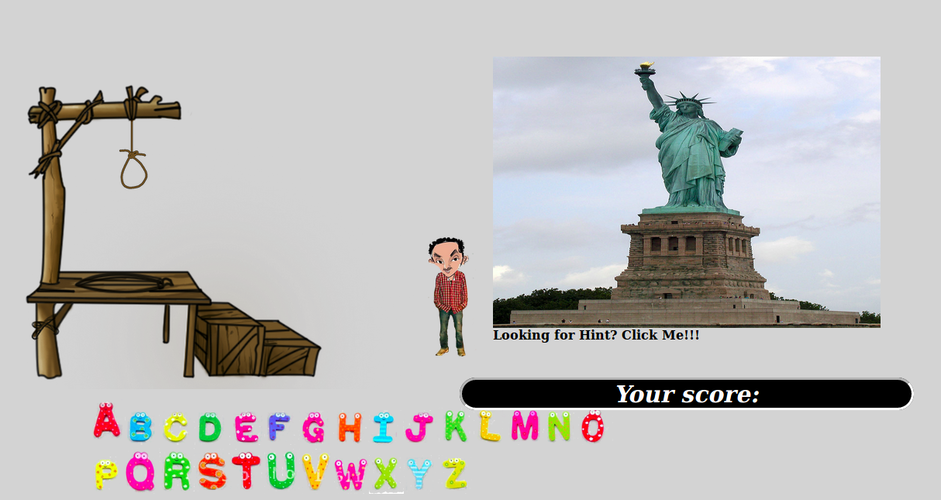

Motivation/ Objective:
* To built a game that tests player testing knowledge about world heritage.

Technologies used:
* HTML,CSS, JavaScript and jQuery.
* Adobe Photoshop and paint also used to prepare images for animation.

Approach:
* The approach used in this game development is step by step incremental way in which different parts of the game developed and tested before further continuing other parts of the game.

Included but unsolved problems:
1. Restart button doesn't restart the game properly
2. The game is not closed when user wants to quit.

Future works:
At this stage, only the basic functionalities are working. But in future I would like to include the following modification:
1. Score point will be half if the player uses the hint.
2. Store the player's history and top scores.
3. Consider different browser and mobile in order to display the game properly.
4. Take more than one value from keyboard, store and compare the result
5. To add option to play alone or with another player

Screen shot of the image can be found from screen_shots directory.
* 
